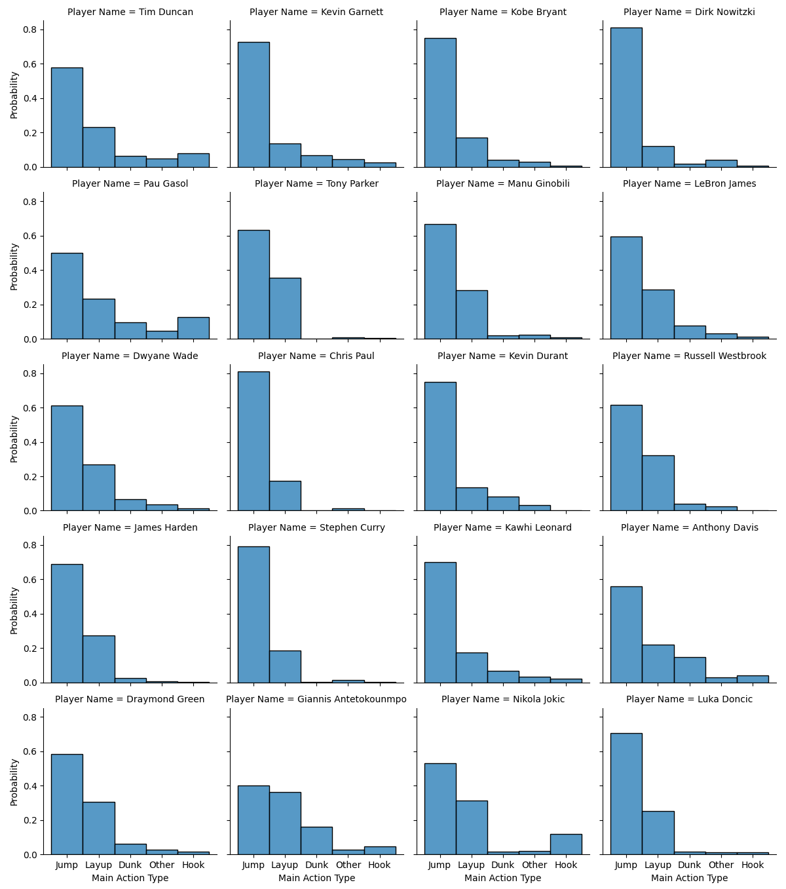
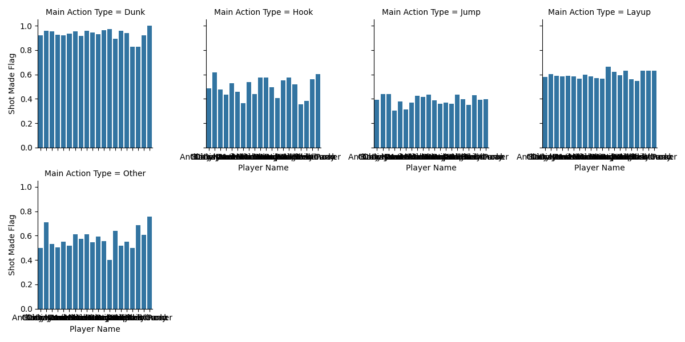
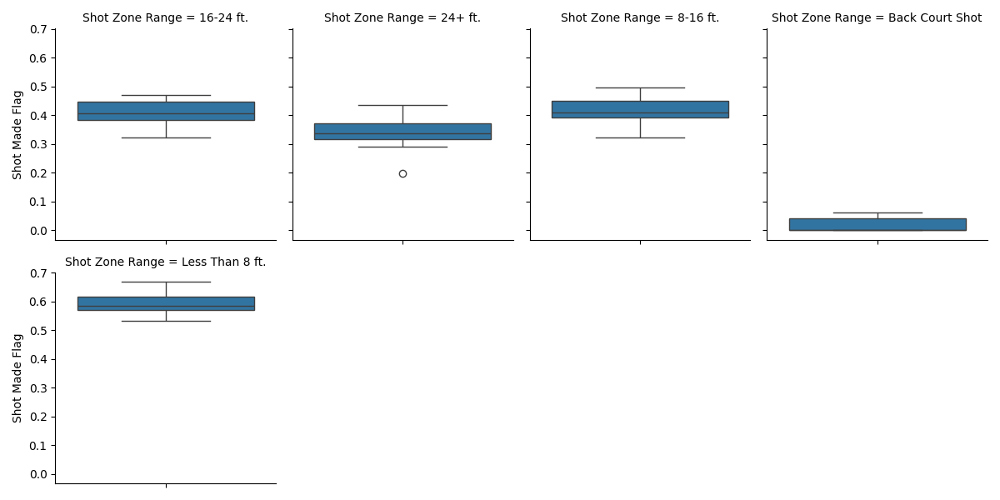
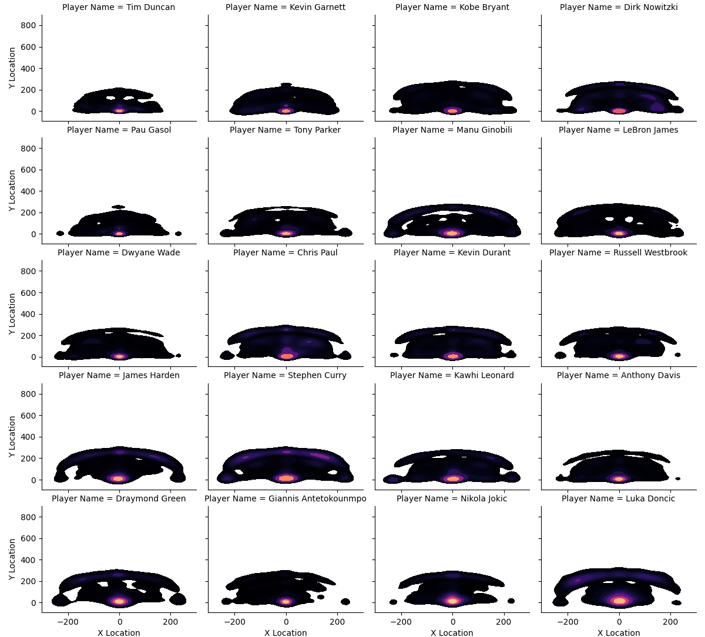

# Player Comparison
To compare the players we are first going to find categories for which we can compare the distribution of all shots 
(I will call "preference"), and the accuracy. The more difference we find between the players the better, because this is where 
the actual information sits and where we can define a player's profile. 
## Shot Types
### Preferences
The shot types contained in the dataset are extremely detailed (~30 different), so they would get too difficult to compare as such.
To tackle that, I grouped them together, just by the appearance of the word "dunk", "jump", "hook", "layup" and "other".

_Explanation: "Probability" is the normalized distribution of the shots among each player._  
It becomes clear, that shot types of the "jump" family are preferred by every player, followed by layups. But there are very different 
distributions among the other types. While there are players who practically do not use any other types, Nicola Jokic uses
lots of hook type shots, while Giannis Antekounmpo has got a relatively high "dunk" rate.

### Accuracy

(Excuse the illegibility of the actual player names.) In this graphic we can directly compare the accuracy of each players shot 
by category. We see that there are shot types which do not
really vary too much among the players. E.g. all players have a very high success rate when it comes to dunks and layups,
but types "hook" and "other", and compared relatively maybe even "jump"  definitely weak spots become visible. 

## Distance
For comparing distances, I used the buckets suggested by the column "SHOT_ZONE_RANGE"
### Preferences
TODO
### Accuracy

We can see that the player's average accuracy in precision by range varies about 15-20% points from min to max. Except for 
the back court shot, for which we do not have very much data and even less hits in total. 

## Location
The x and y locations of the data allow us to draw a clear picture of the players preferred locations and maybe even 
their designated role (C,F,...) can be deducted (TODO).

We can see clear differences in player behavior and preferred positions in this plot. There are players like Tim Duncan 
and Kevin Garnett, who clearly prefer the game close to the basket, while there are others like Giannis Antekounmpo who have 
a much broader profile and who have distinct rings or spots outside the 3 points line in their plot. Some do even ONLY 
attempt three point shots from "rectangular" positions, i.e. 0 and +-90° (Pau Gasol). Many have distinct spots standing
parallel to the baskets baseline (y=0).  
Moreover, many profiles reveal distinct "eyelets". These seem to be unpopular position either because they are ineffective 
(just NOT outside the three point zone) or maybe well guarded (center eyes at x=+-30, y=100). Some players (e.g. Luka Doncic, Draymond Green)
reveal a strong "either or" behavior when it comes to Three-Point-Zone vs Close-to-the-basket, leaving large blank zones inside
the Three-Point-Zone.