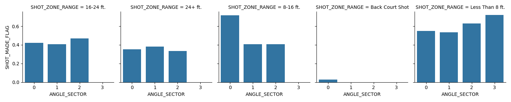
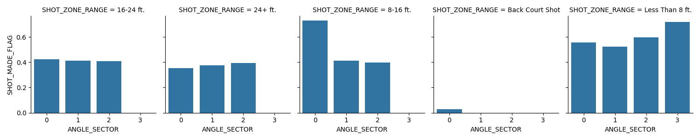

# Relations
In this document, we will explore the variable relations to the target variable.
## Distance
The continuous distance has a collelation with the target variable of about -0.05. Of course,
the coefficient is negative, because it is harder to make a shot at a wider distance. I was surprised
it is actually that low, but I guess other important factors, like less density of defense players that are hard to measure, 
will play a role here and make long distance shots a bit easier in comparison.
The distance has some cross-effects with other variables I am about to explore. I will use the distance bin (SHOT_RANGE_ZONE) as one of the multivariate variables together
with the following variables.
## Angle
### Introducing the angle variable and its orientation
I calculated the angle by atan2(x,y) (which is the wrong way round if you insist on 
mathematically naming the axis and angles). That way, we are symmetric around the y-axis, which 
seemed more appropriate than the x-axis, because +10° and -10° basically mean the same, only left and right.
### Introducing sectors (angle bins)
Apart from the basic correlation of ABS_ANGLE to the target variable, there seems to be a 
quite nonlinear relation between the two, especially when regarding small distances. Shots that
are marked as coming from directly behind the basket are astoundingly precise, although the have the highest angle. 
I would consider introducing a sector variable that could be OneHotEncoded and contribute to our model precision
based on the distance. I suppose this will help the model learn that "High angle" is not always bad for a made shot.
I made two attempts chosing the borders. +-45deg, +-90deg, +-135deg, rest. But also 55deg and 100deg respectively. 
The last one might be a bit more semantically fitting, because on the 90deg axis, there is a hotspot for 3pt shots and 
it goes a bit further than 90 degrees. 
### Angle vs Distance
As already mentioned, the distance has a big influence on the meaning of the angle. Have a look at two plots each with the
45/90 and with the 55/100 deg ANGLE_SECTOR division mentioned. 

_The 55/100deg separation between sectors 1,2 and 3 resp._
You can see that at 24ft it is clearly the second sector that is most successful. While at smaller distances,
frontal and very steep angles are more sucessful. At <8ft, even shots from directly behind the basket. 

_The 45/90deg separation between sectors 1,2 and 3 resp._
The different separation of the angle sectors introduced some shift in the meaning for the success probability, mainly at 
the distance bins 16-24 and 24+ft. That shows us that semantically, there is a lot happening in these are ranges. It is yet to 
define, what separations will be good for the actual model.

## Correlation Matrix
For the sake of simplicity, I only include the target variable row. 

| |SHOT_DISTANCE|   PERIOD_x|  MINUTES_REMAINING|     ANGLE|  ABS_ANGLE|  ANGLE_SECTOR|   IS_HOME|  
|---|---|---|---|---|---|---|---|
|SHOT_MADE_FLAG         |-0.054469 |-0.023994           |0.036138 | 0.001744   |0.023058     | 0.025517 | 0.01412|

We can see, that the coefficients are very low, albeit with a sign we'd expect from their semantics (exception: angles, see according section)
I would still expect that the correlation is meaningful, because we have a really huge dataset. Statistical tests will 
make sure that we are not hunting ghosts here. Also, a more thorough multivariate analysis of the variables could show
some dependency of the correlation on another variable, as seen when regarding angle and distance together.

